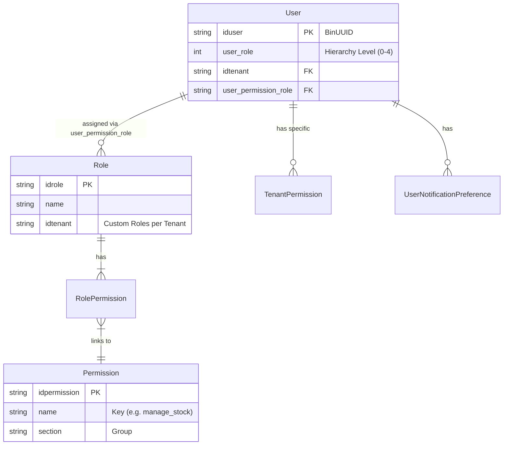

# Security & Access Control Specification

> **Version:** 1.1
> **Last Updated:** 2025-12-31
> **Type:** Core Component Documentation
> **Target Audience:** Architects, Backend Developers, Frontend Developers, System Administrators

## 1. Executive Summary

This document serves as the central source of truth for the **Authentication, Authorization, and Security Architecture** of the Maya application. It details the multi-layered security model that ensures data isolation, secure access, and granular feature control.

The system employs a **Three-Layer Security Model**:
1.  **Network & Identity Layer (Layer 1):** JWT-based Authentication.
2.  **Tenant Isolation Layer (Layer 2):** Mandatory Tenant/Group ID validation for every request.
3.  **Application Logic Layer (Layer 3):** Fine-Grained Role-Based Access Control (RBAC) and Feature Packages.

---

## 2. Security Architecture Overview

### 2.1 The 3-Layer Defense
| Layer | Name | Technology | Responsibility |
| :--- | :--- | :--- | :--- |
| **L1** | **Identity** | JWT (ReallySimpleJWT / Tymon) | Verifies *"Who are you?"* (Authentication) |
| **L2** | **Isolation** | `AuthChecker` Middleware | Verifies *"Can you touch this Tenant/Group?"* (Data Security) |
| **L3** | **Capability** | Frontend Store / RBAC Tables | Verifies *"Can you perform this Action?"* (Feature Access) |

### 2.2 User Identity Model
Every user in the system is defined by three core identifiers that accompany every request:
*   **`iduser` (Caller ID):** The UUID of the authenticated user.
*   **`idtenant` (Context):** The organization the user is currently acting within.
*   **`iddefault_group` (Scope):** The specific sub-group (e.g., specific farm/site) context.

---

## 3. Database Schema (RBAC Model)

The permission system is data-driven, residing in the `core-2.0` database.

### 3.1 Entity Relationship Diagram (Conceptual)


### 3.2 Role Hierarchy (`user_role`)
Defined in `PERMISSIONS.USER_ROLES` (Frontend) and `User` model. This is a hard-coded hierarchy level used for broad access checks.

| Level | Role Name | Description |
| :--- | :--- | :--- |
| **0** | **OWNER** | Full access to everything in the Tenant. Bypasses most checks. |
| **1** | **ADMIN** | High-level administration (User management, Settings). |
| **2** | **EDITOR** | Can create/edit operational data (Spraying, Tasks). |
| **3** | **VIEWER** | Read-only access. |
| **4** | **TEAM_MANAGER** | Manages staff and schedules only. |

---

## 4. Operational Management (Functionality)

This section details how permissions are managed operationally within the application.

### 4.1 Assigning Roles
*   **Location:** User Management Page (`/user`).
*   **Action:** Admins click "Edit" on a user card to open the `UserForm` modal.
*   **Primary Role:** The `user_role` (Owner, Admin, Viewer) is selected from a dropdown. This sets the broad hierarchy level.
*   **Additional Roles (Custom Permissions):**
    *   If `Primary Role` is set to **Viewer**, an "Additional Role" dropdown appears.
    *   This maps to `user_permission_role` in the database, allowing granular permission sets (e.g., "Field Scout" who can only view Maps but create Incident Reports).

### 4.2 Modifying Custom Permissions
*   **Creation:** Admins create new roles via the "Plus" button in the "Additional Role" section (`RoleForm` modal).
*   **Permission Selection:** The UI presents a checklist of granular permissions grouped by module (e.g., *Spraying*, *Insights*).
*   **Storage:** Saving writes to the `roles` and `role_permissions` tables.
*   **Scope:** Custom roles are **Tenant-Specific**. A role created in Tenant A does not exist in Tenant B.

### 4.3 Impact Analysis
*   **Frontend Propagation:**
    *   **Session State:** Permissions are loaded into the `permissionStore` upon login or page refresh (`userInfo` fetch).
    *   **Latency:** Changes made by an Admin (e.g., revoking "Spraying" access) will likely require the target user to **refresh their page** or **re-login** to see the effect, as the frontend store is initialized once per session/load.
*   **Backend Enforcement:**
    *   **Immediate:** Tenant isolation (`AuthChecker`) checks the database on *every request*, so revoking a user's Tenant access is immediate.
    *   **Granular:** If a Controller relies on `User::getPermissions()` (which queries DB), the effect is immediate. If it trusts the JWT claims, it might persist until token expiry (Short-lived tokens mitigate this).

---

## 5. Frontend & Client-Side Security

The client (Vue.js) enforces **Layer 3 (Capability)** security to provide a good UX, hiding unauthorized elements. **Note: Client-side security is for UX, not absolute protection.**

### 5.1 Permission Store (`web/src/store/permission`)
The `usePermissionStore` is the brain of the client-side security.

*   **State:**
    *   `permissions.userRole`: The hierarchy level (0-4).
    *   `permissions.packagePermissions`: Enabled features (e.g., `SPRAYING: true`).
    *   `permissions.rolePermissions`: List of granular permission keys (e.g., `['manage_stock', 'create_report']`).

*   **Key Functions:**
    *   `hasPermission(key)`: Checks if the user has a specific granular permission OR is an Admin/Owner.
    *   `hasPageAccess(routeName)`: Checks if the user's License Package allows viewing this page.

### 5.2 Router Security (`web/src/router`)
Routes are protected globally in `router/index.js` using `beforeEach` guards.

1.  **Authentication Guard:** Checks if `auth_token` exists.
2.  **Package Guard:** Checks `packageRoutes`. If a user tries to access `/spraying` but their license doesn't include the "Spraying Package", they are redirected to Dashboard.
3.  **Inventory Role Guard:** Special logic for Inventory pages (`stock`, `purchase`) requiring specific `INVENTORY_ROLES`.

### 5.3 Navigation Visibility (`web/src/_nav.js`)
The sidebar menu dynamically renders items based on permissions.
```javascript
// Example from _nav.js
{
  name: 'Spraying',
  to: '/spraying',
  page_access: PERMISSIONS.PACKAGE.SPRAYING // Only shows if Package is enabled
}
```

---

## 6. Backend & Server-Side Security

The API (`core-2.0`) enforces **Layer 1 (Identity)** and **Layer 2 (Isolation)** strictly on every request.

### 6.1 Middleware Stack
Traffic flows through these gates defined in `app/Http/Kernel.php` and `routes/api.php`:

1.  **`Cors`**: Handles Cross-Origin requests.
2.  **`AuthChecker` (`app/Http/Middleware/AuthChecker.php`)**:
    *   **Step 1:** Decodes and Validates JWT Token (Verification/Expiration).
    *   **Step 2:** Extracts `callerId` (User), `tenantId`, and `defaultGroupId`.
    *   **Step 3:** **CRITICAL:** Calls `TenantAuthorizationTrait::validateUserTenantAccess`.
        *   Queries the database to ensure `callerId` is *actually* a member of `tenantId`.
        *   If the request contains `idgroup` or other tenant params, it validates *those* too.
    *   **Result:** If passed, injects `callerId`, `tenantId`, `apiKey` into the `$request` object.

### 6.2 Tenant Authorization Trait (`app/Traits/TenantAuthorizationTrait.php`)
This is the **Core Security Mechanism**. It prevents "Insecure Direct Object Reference" (IDOR) attacks across tenants.
*   **Method:** `validateUserTenantAccess($userId, $tenantId)`
*   **Logic:** Users can *only* act on data belonging to their assigned Tenant. You cannot request data for Tenant B if you belong to Tenant A, even with a valid Token.

### 6.3 Fine-Grained Permission Enforcement (Gap Analysis)
*   **Current State:** The API relies heavily on Layer 2 (Tenant Isolation).
*   **Implicit Trust:** If a user is authenticated and belongs to the Tenant, many Controllers (`SprayingController`) trust they can perform actions (Create/Delete) without a secondary `can('create_spraying')` check.
*   **Recommendation:** Security Critical actions (Deletions, Configuration Changes) should implement explicit Gate checks using the `User::getPermissions()` method.

---

## 7. Access Control Reference

### 7.1 Package Permissions (Feature Flags)
Defined in `web/src/store/permission/constants.ts`. These control **Course Level** visibility.
*   `PERMISSIONS.PACKAGE.SPRAYING`
*   `PERMISSIONS.PACKAGE.INVENTORY`
*   `PERMISSIONS.PACKAGE.FLEET_MANAGEMENT`

### 7.2 Granular Permissions (Role Capabilities)
Defined in `permissions` table and mapped in `User` model.
*   **Stock:** `manage_stock`, `manage_deliveries`, `manage_products`
*   **Fleet:** `add_new_machine`, `update_fuel_level`
*   **Team:** `team_management_edit_staff`

---

## 8. Developer Guidelines

### How to Add a New Protected Feature
1.  **Database:** Insert new permission key into `permissions` table.
2.  **Frontend (Constants):** Add key to `PERMISSIONS` object in `web/src/store/permission/constants.ts`.
3.  **Frontend (UI):** Use `v-if="permissionStore.hasPermission(PERMISSIONS.NEW_FEATURE)"` to hide buttons.
4.  **Backend (Optional but Recommended):** Add `if (!$user->can('new_feature')) abort(403);` in the Controller.
