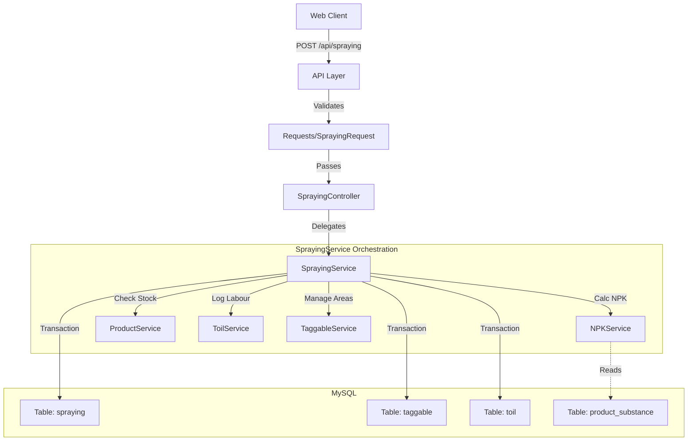

# Nutritional Inputs (Spraying)
## Technical Design Specification

---

### Document Control
| Attribute | Value |
|:---|:---|
| **Document ID** | MAYA-TDS-SPRAY-002 |
| **Version** | 2.0 (Premium) |
| **Last Updated** | December 31, 2025 |
| **Status** | Approved |
| **Owner** | Engineering Team |
| **Classification** | Internal - Technical |

---

## 1. System Architecture

### 1.1 High-Level Overview
The Spraying module is a complex transaction system that orchestrates data across five domains: **Agronomy, Inventory, Fleet, Team, and Reporting**. It uses a robust MVC architecture within the Laravel/Vue monorepo.



### 1.2 Technology Stack
*   **Frontend:** Vue.js 3 (Options API), Pinia (State), CoreUI.
*   **Backend:** Laravel 10, PHP 8.2.
*   **Database:** MySQL 8.0 (InnoDB engine for ACID transactions).

---

## 2. Component Detail

### 2.1 Backend Class Diagram (`SprayingService.php`)

| Method | Responsibility | Key Logic |
|:---|:---|:---|
| `findSprayingRecords` | Retrieves filtered list of tasks. | Uses **derived table optimization** to filter by Tenant Zones efficiently (avoiding `WHERE IN` limits on large datasets). |
| `addSpraying` | Creates new transaction. | Orchestrates `DB::beginTransaction()`, creates `spraying` record, inserts `taggable` (areas), and logs `toil` (overtime) atomically. |
| `updateSpraying` | Updates existing record. | Performs a **hard reset** on areas: `DELETE FROM taggable WHERE idspraying = X` followed by `INSERT`. |
| `getReportActualVsPlannedNpk` | Generates Comparison Data. | Complex aggregation query summing `quantity * substance_percentage` grouped by week. |

### 2.2 Frontend Component Interaction

*   **`SprayingForm.vue`**: The "Smart Container".
    *   **State:** Manages the temporary form state (`form.list`) before submission.
    *   **Watchers:** Monitors user input to trigger real-time calculations (Mulder's Rule, Nozzle Capacity).
    *   **Props:** Receives `formOptions` (sites, products, machinery) from the parent view to minimize API chatter.
*   **`SprayingFormItem.vue`**: The "Row Component".
    *   Represents a single product line in the form.
    *   Emits `remove` and `update` events up to the parent.

---

## 3. Data Dictionary & Schema

### 3.1 Primary Entity: `spraying`
The central fact table storing the "who, what, where, when".

| Column | Type | Description |
|:---|:---|:---|
| `idspraying` | BINARY(16) | UUID. Primary Key. |
| `idsite` | BINARY(16) | UUID. Foreign Key to `site` (The Course/Pitch). |
| `idproduct` | BINARY(16) | UUID. Foreign Key to `product`. |
| `quantity` | DECIMAL(12,2) | **Total Quantity** applied (e.g., 50.00 Kg). |
| `quantity_area_unit` | DECIMAL(12,2) | **Rate** (e.g., 25.00 Kg/Ha). |
| `dilution_volume` | DECIMAL(12,2) | Water volume in Liters. |
| `status` | TINYINT | `1`: To Do, `2`: Running, `3`: Completed. |
| `spraying_routine_id` | BINARY(16) | **Grouping Key**. All products in a single tank mix share this ID. |
| `n_units` | DECIMAL(10,2) | Cached Nitrogen value to speed up dashboards. |

### 3.2 Join Table: `taggable`
Resolves the Many-to-Many relationship between a `Spraying` task and `Tags` (Areas).
*   *Why?* A sprayer might cover "Green 1", "Green 2", and "Green 3" in one go.
*   **Schema:** `idtaggable` (PK), `idspraying` (FK), `idtag` (FK).

---

## 4. Key Algorithms

### 4.1 Nozzle Capacity Calculation
Determines if the physical setup can achieve the desired output.
**Formula:**
$$ Capacity = \frac{Rate_{spraying} \times Speed_{truck} \times Width_{nozzle}}{Constant} $$

Code Implementation (`SprayingForm.vue`):
```javascript
// Metric Calculation
// Constant 60000 converts minutes/hours and units
value = (sprayingSpeed * (truckSpeed * 50)) / 60000;

// Imperial Calculation
// Constant 5940 derives from gallon/mile conversions
value = (sprayingSpeed * (20 * truckSpeed * 43.56)) / 5940;
```

### 4.2 NPK Decomposition
Calculates the elemental nutrient load.
**SQL Logic:**
```sql
ROUND(
    SUM(
        CASE 
            -- Check for Nitrogen Substance
            WHEN substance.name = 'N' 
            THEN (
                spraying.quantity *              -- Total KG of Product
                product_substance.quantity *     -- % of N in Product
                product.gravity                  -- Specific Gravity (for liquids)
            ) / 100 
            ELSE 0 
        END 
        * 
        -- Gram conversion factor if unit is 'g'
        CASE WHEN product.unit = 'g' THEN 10 ELSE 1 END
    ), 
2) as npk_n
```

---

## 5. Security & Performance

### 5.1 Optimization Strategy
*   **Derived Tables:** The `findSprayingRecords` method dynamically builds a temporary SQL table of allowed Zone IDs before joining. This prevents "Packet too large" errors when filtering against thousands of zones in a `WHERE IN` clause.
*   **Lazy Loading:** Reporting charts load asynchronously. Use of `n_units` cache column prevents recalculating NPK from scratch on every page load.

### 5.2 Data Integrity
*   **Transactionality:** The `SprayingService` wraps all writes in `DB::beginTransaction()`. If the Inventory deduction fails, the Spraying log is rolled back, preventing data drift (e.g., "Log exists but stock wasn't taken").

---

**Document End**
