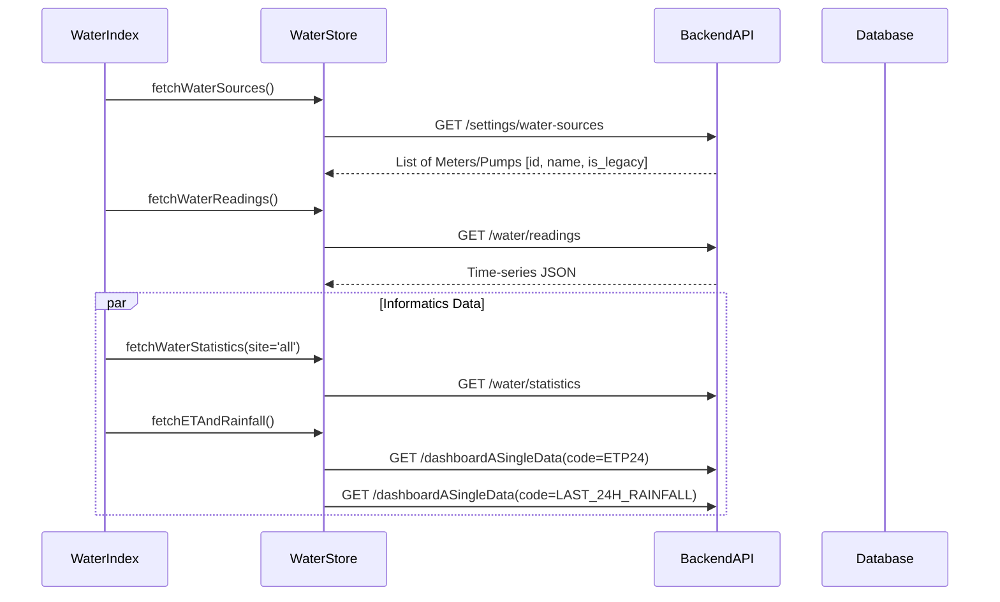

# Water Feature - Technical Documentation

## Document Information
- **Version**: 1.0 (Premium)
- **Date**: December 30, 2025
- **Page**: Water
- **Route**: `/water`
- **Primary View**: [`web/src/views/water.vue`](file:///c:/www/mayaApp/web/src/views/water.vue)

---

## 1. Frontend Architecture

### 1.1 Component Structure
The feature is implemented as a wrapper view `water.vue` containing the main controller `Index.vue` (aliased as `WaterIndex`).

| Component | Path | Responsibility |
| :--- | :--- | :--- |
| **`WaterIndex`** | `web/src/components/water/WaterIndex.vue` | Main controller. Manages usage table, filtering, and data entry forms. |
| **`WaterInformatics`** | `web/src/components/water/WaterInformatics.vue` | Dashboard rendering. Fetches aggregated KPIs. |
| **`InformaticsCard`** | `web/src/components/water/InformaticsCard.vue` | Reusable UI widget for individual metrics calculations. |
| **`WaterForm`** | `web/src/components/water/WaterForm.vue` | Modal form for Creating/Editing readings. Handles validation. |

### 1.2 State Management (`water` Store)
State is centralized in [`web/src/store/water.js`](file:///c:/www/mayaApp/web/src/store/water.js).

**Core Actions**:
- `fetchWaterReadings`: Retrieves time-series data for the Usage Table.
- `fetchWaterStatistics`: Aggregates consumption data (Monthly/Yearly/Days).
- `fetchETAndRainfall`: **Aggregator Action**. Fetches legacy sensor data (`LAST_24H_RAINFALL` and `ETP24`) from the Dashboard API to calculate Water Balance.

---

## 2. API Strategy & Data Flow

### 2.1 Backend Interaction Sequence

### 2.2 Key Endpoints

| Endpoint | Method | Purpose | Key Parameters |
| :--- | :--- | :--- | :--- |
| `/water/readings` | `GET` | Main list of usage entries. | `tenant_id` |
| `/water/statistics` | `GET` | Aggregated consumption metrics. | `tenant_id`, `site_id` |
| `/settings/water-sources` | `GET` | Configuration of physical meters. | `tenant_id` |
| `/dashboardASingleData` | `GET` | **Legacy Support**. Used for Weather integration. | `code` (`ETP24`, `LAST_24H_RAINFALL`) |

---

## 3. Data Models

### 3.1 Water Source (`water_sources`)
Represents a physical or virtual input method.
- `source_type`: Defines if it's a meter, pump, or manual input.
- `is_legacy`: Boolean. If true, source is hidden from new entry selectors but visible in history.

### 3.2 Water Reading (`water_readings`)
The atom of data in the system.
- `measurement_type`:
    - `meter_reading`: Input is a cumulative counter value. System calculates delta.
    - `consumption_value`: Input is the explicit volume used.
- `reading_value`: The raw number entered by user/sensor.

### 3.3 System Codes (Legacy Integration)
The Water module relies on specific global sensor codes for its Informatics calculation:
- **`ETP24`**: Evapotranspiration over the last 24 hours.
- **`LAST_24H_RAINFALL`**: Total rainfall accumulation over the last 24 hours.

---

## 4. Security & Permissions
- **Permissions**: Managed via `usePermissions`.
    - `PERMISSIONS.WATER.CREATE_NEW_RECORDS`: Required to see the "Add" button.
    - `PERMISSIONS.WATER.EDIT_DELETE_RECORDS`: Required for Row Actions.
- **Scope**: All data is strictly scoped to the `idtenant` of the logged-in user.

---

**Document End**
