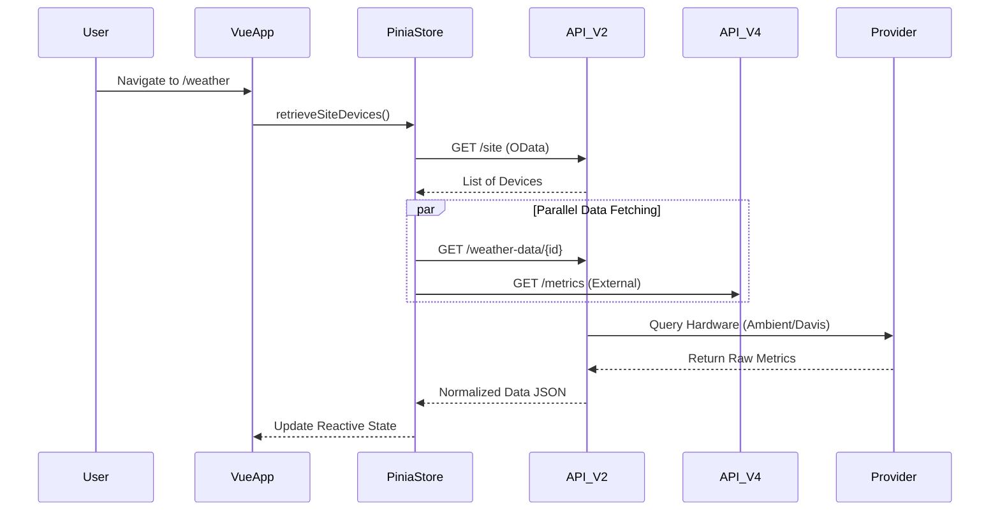

# Weather Page - Technical Documentation

## Document Information
- **Version**: 1.1 (Premium)
- **Date**: December 30, 2025
- **Page**: Weather
- **Route**: `/weather`
- **Primary File**: `web/src/views/weather.vue`

---

## 1. Frontend Architecture

### 1.1 Core Components
The Weather view relies on a modular component structure to separate display logic for different sensor groups.

| Component | Responsibility |
| :--- | :--- |
| **`weather.vue`** | Main container; handles routing, site selection, and global state orchestration. |
| **`WeatherItem.vue`** | Pure presentational component for individual metric cards (Temp, Wind). |
| **`WeatherChart.vue`** | Wrapper around Chart.js/ApexCharts for historical data visualization. |
| **`SummarySoilPopUp.vue`** | Detailed modal for soil sensor aggregates and depth analysis. |

### 1.2 State Management (`piniaWeather`)
State is managed centralized in `web/src/store/weather.js` to ensure data consistency across widgets.

> [!WARNING]
> Weather data is cached for performance. Always use `getWeatherData()` with explicit `startDate`/`endDate` to bypass stale cache when filtering.

**Key State Properties**:
- `data`: List of site devices and their basic metadata.
- `weatherData`: Raw metrics for the current site.
- `chartData`: Data specifically formatted for historical graphing.
- `groupDevices`: Configuration for virtual or grouped sensor devices.

---

## 2. API Strategy & Data Layer

### 2.1 Backend Data Flow

### 2.2 Endpoint Specification

| Scope | Method | Endpoint | Purpose |
| :--- | :--- | :--- | :--- |
| **Site Mgmt** | `GET` | `/site` | Retrieve site hierarchy and linked sensors. |
| **Real-time** | `GET` | `/weatherSingleData` | Fetch latest value for a specific sensor code (e.g., `T1`). |
| **Analysis** | `GET` | `/weather-data/{id}` | Batch retrieval of historical data for charting. |
| **External** | `GET` | `/api/v4/metrics` | Public API for third-party integrations (Token Auth). |

---

## 3. Data Flow & Integration

### 3.1 External Weather Providers
The backend orchestrates data from multiple hardware and virtual providers, normalizing them into a common Maya data model:
- **Physical**: Ambient Weather, Netatmo, WeatherLink (Davis).
- **Virtual**: OpenWeatherMap (Forecasts).

### 3.2 Unit Conversion Strategies
The system stores all data in **Metric (SI)** units by default. Conversion happens **dynamically on the frontend** at render time.

> [!TIP]
> Do not convert data in the store. Keep state pure (Metric) and use Vue computed properties for Imperial display.

- **Temperature**: `(C * 9/5) + 32`
- **Wind**: `km/h * 0.621371`
- **Rain**: `mm * 0.0393701`

---

## 4. Security & Access Control

### 4.1 Token-Based Access
Public access to weather data (for embedded widgets) is secured using individual API tokens. These tokens can be scoped to specific sites to prevent unauthorized data exposure.

### 4.2 Secured Iframe Widgets
The `WidgetHagaController` facilitates secure embedding.

**Security Mechanism**:
1.  **Encryption**: Parameters (`id`, `metrics`) are AES-256 encrypted using the tenant's app key.
2.  **Signature**: Requests are signed to prevent tampering.
3.  **Whitelisting**: (Optional) Usage can be restricted to specific referrer domains.

---

## 5. Directory Mapping

| Layer | File Path |
| :--- | :--- |
| **View** | [`web/src/views/weather.vue`](file:///c:/www/mayaApp/web/src/views/weather.vue) |
| **Store** | [`web/src/store/weather.js`](file:///c:/www/mayaApp/web/src/store/weather.js) |
| **Model** | [`web/src/plugins/sensors.js`](file:///c:/www/mayaApp/web/src/plugins/sensors.js) |
| **Service** | [`core-2.0/app/Services/DeviceService.php`](file:///c:/www/mayaApp/core-2.0/app/Services/DeviceService.php) |
| **Controller** | [`core-2.0/app/Http/Controllers/WeatherController.php`](file:///c:/www/mayaApp/core-2.0/app/Http/Controllers/WeatherController.php) |

---

---

## 6. Sensor Reference (System Codes)

The following table maps system-internal codes to their display names and units, as defined in `web/src/plugins/sensors.js`.

| Code | Metric Name | Unit | Type |
| :--- | :--- | :--- | :--- |
| `T1` | **Air Temperature** | °C | Physical |
| `HR1` | **Air Humidity** | % | Physical |
| `WS1` | **Wind Speed** | km/h | Physical |
| `WS2` | **Wind Gust** | km/h | Physical |
| `R1` | **Rainfall** | mm | Physical |
| `PY1` | **Solar Radiation** | W/m² | Physical |
| `ETP` | **Evapotranspiration** | mm | Calculated |
| `LWS1` | **Leaf Wetness** | % | Physical |
| `LWD` | **Leaf Wetness Duration** | - | Calculated |
| `P1T1_5CM` | **Soil Temperature** | °C | Physical (Depth) |
| `P1M1_5CM` | **Soil Moisture** | % | Physical (Depth) |
| `SOIL_OXYGEN` | **Soil Oxygen** | % | Physical |
| `DOLLAR_SPOT` | **Dollar Spot Risk** | - | Model |
| `FUSA_2` | **Fusarium Risk** | - | Model |
| `GP` | **Growing Potential** | % | Model |

---

**Document End**
