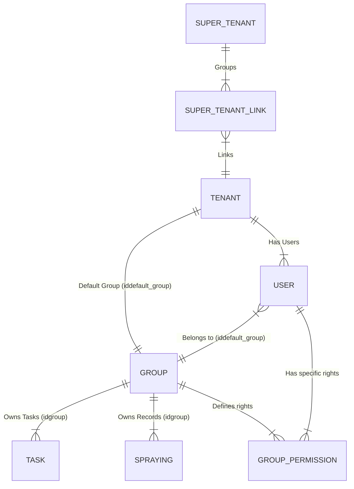

# Multi-Tenant Architecture Documentation

> **Generated:** 2025-12-23
> **System:** Core 2.0 (Laravel)

## Overview

The application uses a **Shared Database, Column-Based Multi-Tenancy** architecture. All tenants share the same database schema and tables. Data isolation is achieved logically via `tenant_id` (or `group_id`) columns and explicit query scoping in the Service/Repository layer.

## Core Components

### 1. Database Schema
*   **Tenant Table**: `tenant` table stores tenant configurations (settings, address, etc.). PK: `idtenant`.
*   **User Association**: Users are linked to a tenant via `user.idtenant` and `user.iddefault_group`.
*   **Data Isolation**:
    *   Most operational data (Tasks, Spraying) is linked to a **Group** (`idgroup`) rather than directly to a Tenant.
    *   A Tenant has a "Default Group" (`iddefault_group`).
    *   Some tables link directly to `idtenant` (e.g., `team`, `report_setting`).

### 2. Authentication & Context
*   **Middleware**: `AuthChecker` and `DualAuthChecker` handle tenant identification.
*   **Token**: JWT tokens contain `idtenant` and `iddefault_group` claims.
*   **Request Context**: The middleware extracts `tenantId` from the token (or request headers/params for legacy calls) and merges it into the `Request` object:
    ```php
    $request->merge([
        'callerId' => $userId,
        'tenantId' => $tenantId,
        'defaultGroupId' => $defaultGroupId
    ]);
    ```

### 3. Authorization
*   **Trait**: `App\Traits\TenantAuthorizationTrait` provides methods to validate access.
*   **Validation**: `validateUserTenantAccess` checks if the authenticated user belongs to the requested tenant ID via `AdminService`.

### 4. Data Access Pattern (Explicit Scoping)
*   **No Global Scopes**: The application does **not** generally use Eloquent Global Scopes to automatically filter by tenant.
*   **Repository Pattern**: Data isolation is enforced in the **Repository** layer. Methods require `idTenant` or `groupId` as arguments.
    *   *Example (`ScheduleRepository`):*
        ```php
        public function getTaskRecordsByTenantAndDate($idTenant, ...) {
            $groupId = $this->adminService->findGroupForTenant($idTenant);
            // Query filters explicitly by groupId
            $tasks = $this->scheduleService->getTasksByGroupIdAndDate($groupId, ...);
        }
        ```

### 5. Super Tenant Architecture (Multi-Tenant Linking)

The system supports a hierarchical structure called **Super Tenant** to key tenants together (e.g., for a franchise or holding company).

*   **Super Tenant Entity**: `super_tenant` table groups multiple standard tenants.
*   **Linking**: `super_tenant_link` table maps a `tenant` to a `super_tenant`.
    *   One Tenant can belong to one Super Tenant (based on current service logic).
*   **Super Admin Role**:
    *   A user can be made a "Super Admin" for a Super Tenant.
    *   **Effect**: The system automatically generates `tenant_permission` and `group_permission` records for *every* tenant linked to that Super Tenant.
    *   **Visibility**: This grants the user read/write access to data across all linked tenants, effectively allowing "multi-tenant link" visibility.
*   **SSO Implication**: `tenant_permission` table includes `sso_enable`, suggesting Super Admins can leverage Single Sign-On to switch availability contexts between linked tenants.

### 6. Permission Hierarchy

The system uses a layered permission model.

1.  **Package Permissions** (Highest Level): Defined at the Tenant level via `idpackage`. Controls overall feature availability for the entire tenant (e.g., "Standard vs Premium").
2.  **Role Permissions** (User Level): `user.user_role` establishes broad access levels (e.g., Admin, Staff, Worker).
3.  **Group Permissions** (Fine-Grained): `group_permission` table.
    *   **Scope**: Specific to a User + Group pair (`iduser` + `idgroup`).
    *   **Granularity**: Controls specific CRUD actions on modules (e.g., `spraying_create`, `site_delete`, `flow_read`, `price_update`).
    *   **Usage**: 
        *   **Frontend (UI)**: Heavily used to toggle visibility of buttons, menus, and forms (e.g., hiding the "Create" button if `spraying_create` is 0).
        *   **Backend**: Managed via `SuperTenantService` and `AdminService` to generate and send these flags to the client.
    *   **Use Case**: Allows overriding or refining access for specific operational areas within a Course/Site. For example, a "Staff" user might have read-only access generally, but be granted `spraying_create` via `group_permission` for a specific site.

    *   **Lifecycle**:
        *   **Generation**: Created automatically when a User is added (`UserService::createWithPermissions`). Values are derived from a **Template** based on the user's role (`GroupPermissionTemplateService`).
        *   **Editing**: Updated via the User Management API (`PUT /users/{id}`). The `updateWithPermissions` method allows modifying these flags, effectively letting Admins customize access for specific users.
        *   **Super Admins**: When a Super Admin is created, they are automatically granted a `group_permission` record with all flags set to `1` (true) for every group in the linked tenants.

    *   **Available Rules (Flags)**:
        The `group_permission` table contains over 60 specific flags. Key categories include:
        *   **General**: `is_admin`, `user_list`, `user_create/read/update/delete`
        *   **Operations**: `spraying_create/read/update/delete`, `task_create...`, `reports_create...`
        *   **Assets**: `machine_create...`, `product_create...`, `site_create...`
        *   **System**: `api_key_read...`, `connection_read...`, `environment_read...`
        *   **Values**: The specific default values (True/False) for each Role (e.g., Staff, Worker) are stored in the `group_permission_template` database table and are applied upon user creation.

## Key Relationships



## Implementation Details

### Tenant Resolution
1.  **JWT/Bearer Token**: Primary source. Contains `idtenant` payload.
2.  **API Key**: For server-to-server calls.
3.  **Legacy Headers**: Supports `idtenant` in headers for backward compatibility.

### Tenant "Group" Concept (Site/Facility)
*   **Definition**: A **Group** represents the specific physical site, facility, or operational unit (e.g., "The Golf Course", "Dimensions Dept").
*   **Relationship**: 
    *   **Tenant** = The Customer / Billing Entity / Legal Owner.
    *   **Group** = The Operational Workplace.
*   **Hierarchy**: One Tenant can have **Multiple Groups**.
    *   *Single-Site Tenant*: 1 Tenant ↔ 1 Default Group.
    *   *Multi-Site Tenant*: 1 Tenant ↔ Many Groups (e.g., a hotel chain with 5 golf courses).
*   **Data Partitioning**: Key operational data (Tasks, Sprayings, Machines, Areas) is linked to `idgroup`, **not** `idtenant`. This ensures that a user working at "Site A" only sees tasks for "Site A", even if the Tenant owns "Site B" as well.

## Best Practices for Development

1.  **Always Require Tenant/Group Context**: Service methods should accept `$idTenant` or `$groupId`.
2.  **Explicit Filtering**: Always include `where('idgroup', $groupId)` or `where('idtenant', $tenantId)` in database queries.
3.  **Validate Access**: Use `TenantAuthorizationTrait` or `AdminService` to ensure the requesting user has rights to the target tenant/group.
4.  **Do Not Assume Global Scope**: Do not rely on "magic" filtering; always verify your queries include the scoping clause.
